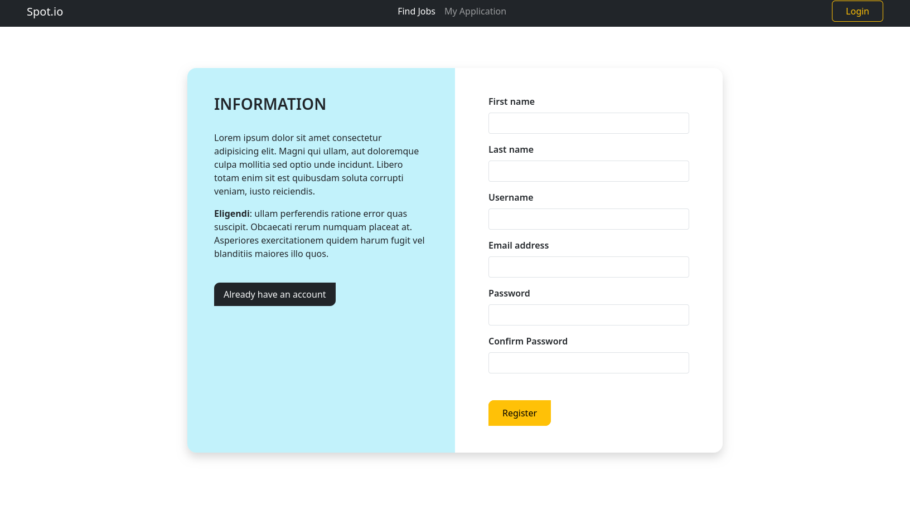
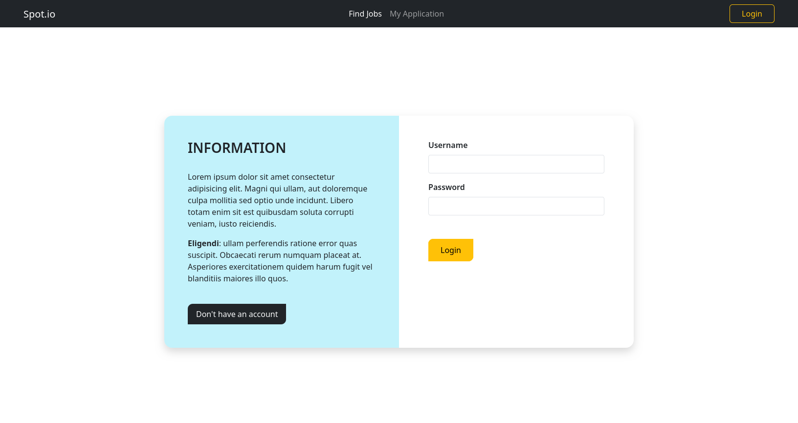
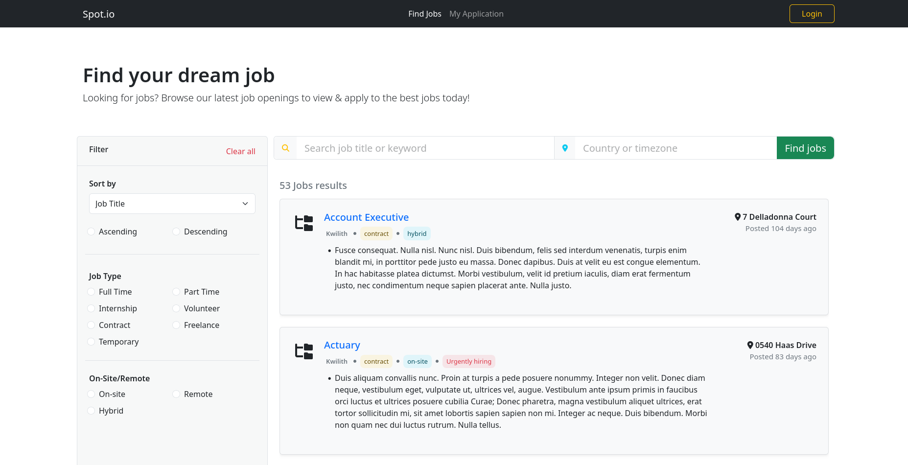
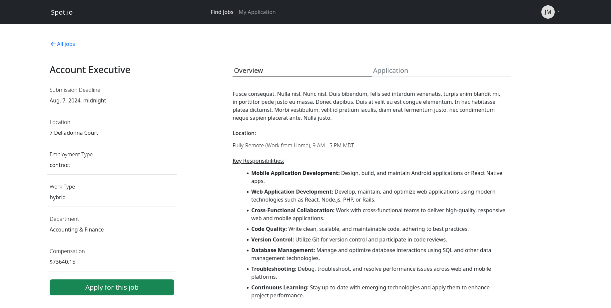
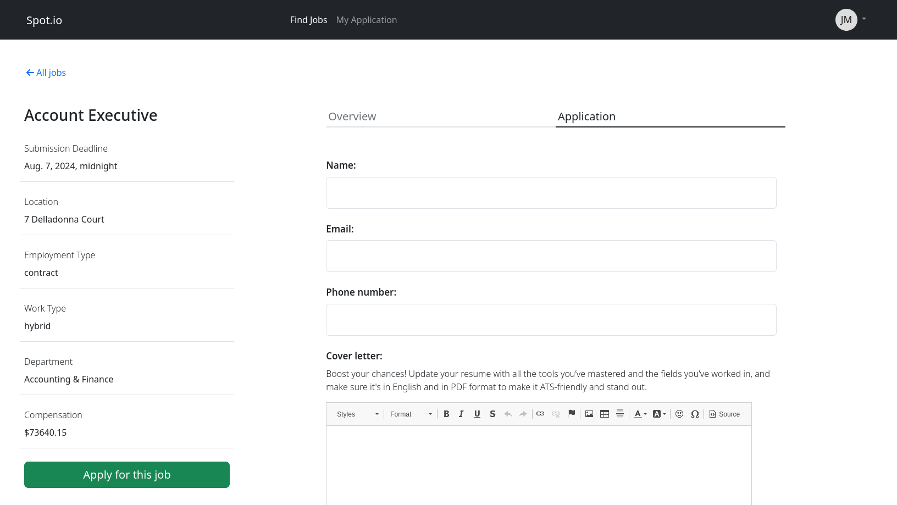

# Job Listing Application

A simple [job listing](./) application were job seekers can view open posts, search, sort, filter jobs and apply to a job.

[Live Demo](./)

## Table of Content

- [Job Listing Application](#job-listing-application)
  - [Table of Content](#table-of-content)
    - [How to run](#how-to-run)
    - [Features](#features)
    - [Screenshot](#screenshot)
  
### How to run

- Create a virtual environment

  ```sh
  > python -m venv .venv
  ```

- Activate it

  ```sh
  > source .venv/bin/activate
  ```

- Install packages

  ```sh
  > pip install -r requirements.txt
  ```

- Start development server

  ```sh
  > python manage.py runserver
  ```

### Features

<!-- **Admin Portal**: -->

**User Portal**:

- ✅ A user should be able to view all available job openings
- ✅ A user should be able to search jobs by title, keyword or location-based
- ✅ A user should be able to filter and sort jobs based on their preferences
- ✅ A user should be able to create an account
- ✅ A user should be able to login to his/her account
- If authenticated,

  - ❌ A user should be able to manage his/her profile
  - ✅ A user should be able to view job details
  - ✅ A user should be able to apply for a job

### Screenshot

1. **User Registration page**

    

2. **User Login Page**

   

3. **Job Listings page**

   

4. **Job Detail Page**

   

5. **Job Application Page**

   
